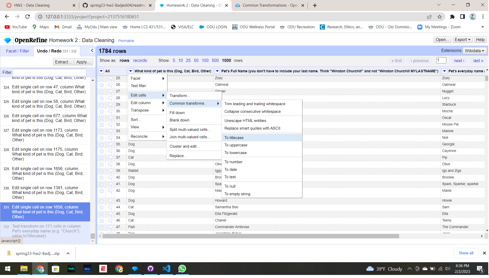
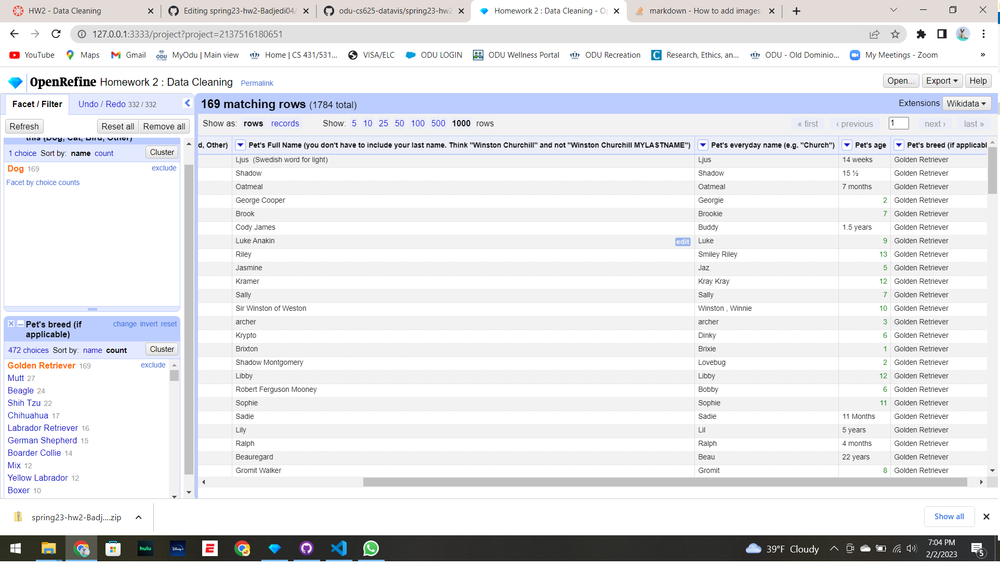
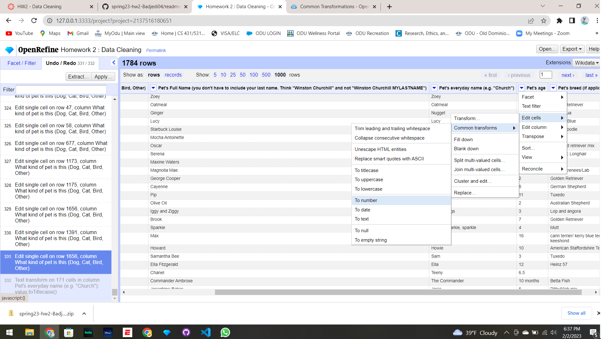
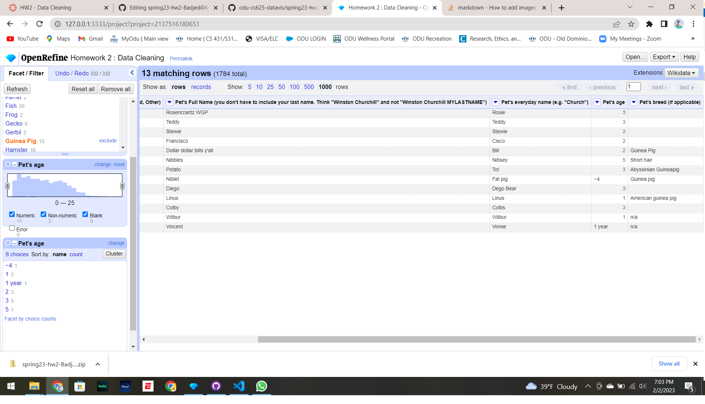
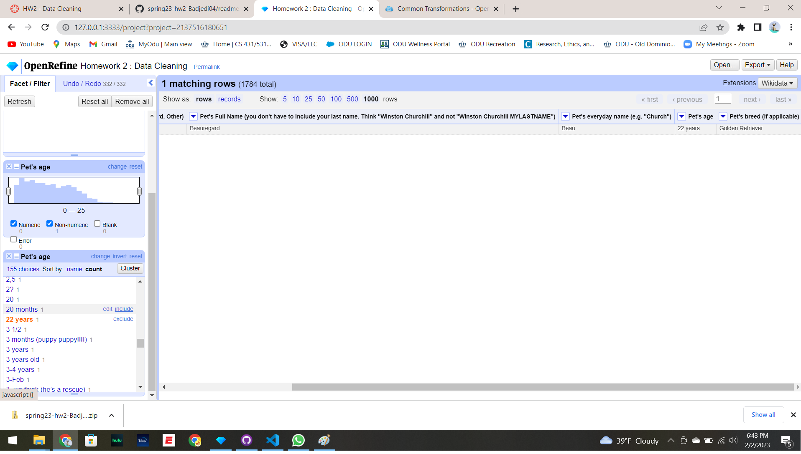
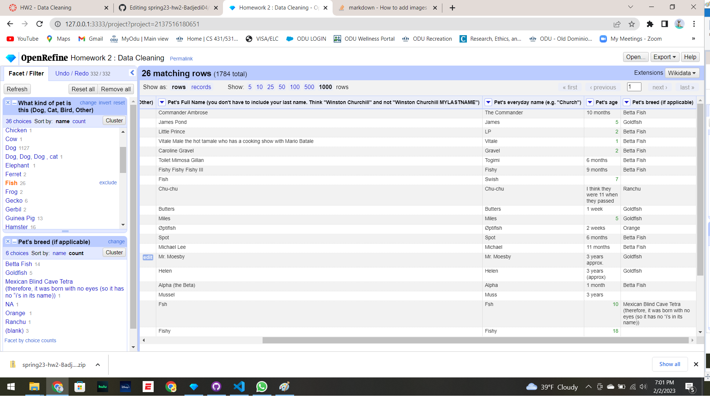
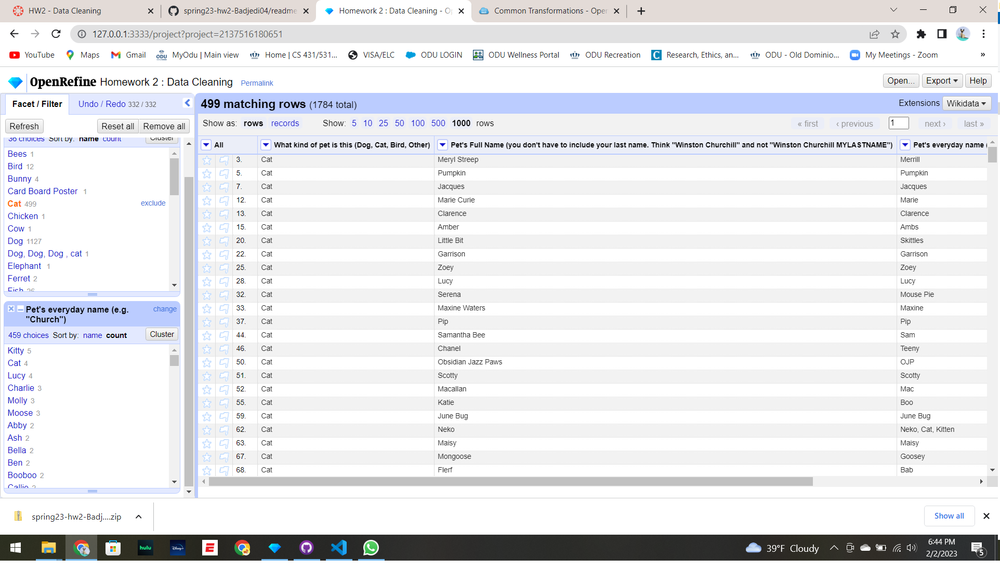
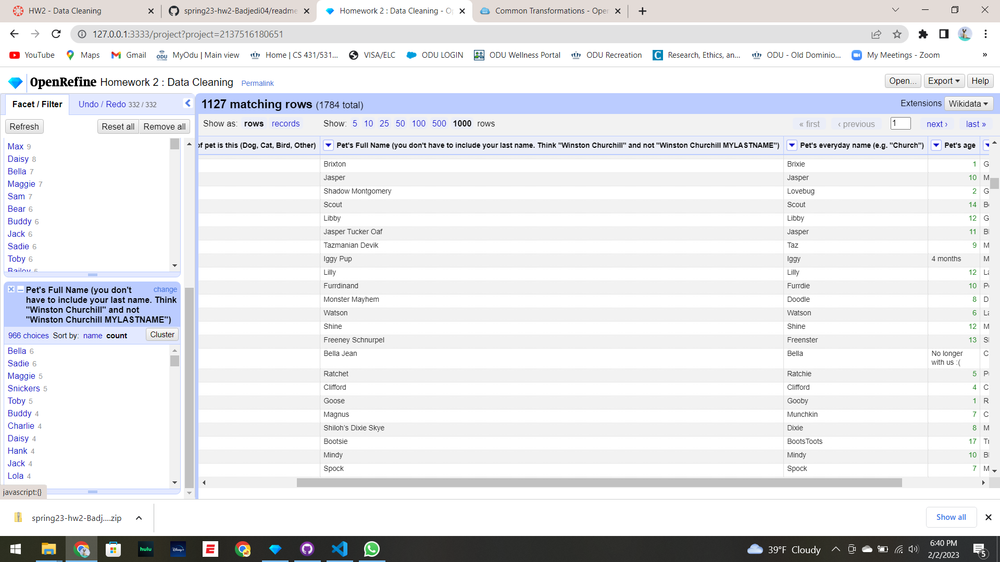

# Data Visualization - CS 625

Homework 2 - Data Cleaning

Spring 2023

Author: Prashant Tomar

UIN - 01215133

Old Dominion University

### Question 1 - How many types (kinds) of pets are there?

#### Answer - There were 29 kinds of pets in total after cleaning the Data.
####         There were about 36 kinds of pets before cleaning but after using text facet I've eleminated 7 of them. Those are
#### 1. Card Board Poster (Row 946)
#### 2. Luna (Row 1003)
#### 3. Roomba (Row 540)
#### 4. Server (Row 53)
#### 5. Virus (Row 264)
#### 6. Other (Row 128 & 94)
#### 7. Blank (Row 333)
#### Step - Convert the entries to Titlecase by  Edit Cells < Common Transforms < To Titlecase
####         Clean the entries individually for spell checks by  Facet < Text Facet

&nbsp;
&nbsp;
### Question 2 - How many dogs?

#### Answer - There are 1130 Dogs in total.
####          Step - "grel:value.replace(\"dog\", \"Dog\")" in Edit cells < Transform
####                 Follow the same formula for other spell checks by replacing the value.
####                 Go to Facet < Text Facet < Dogs in Facet/Filter
&nbsp;
&nbsp;
### Question 3 - How many breeds of dogs?

#### Answer - There are around 396 breeds of dogs in the dataset.
&nbsp;
&nbsp;
### Question 4 - What's the most popular dog breed?

#### Answer - Most popular Dog breed is Golden Retriever with 169 Dogs.
####          Step - Convert the entries to Titlecase by  Edit Cells < Common Transforms < To Titlecase
####                 "grel:value.replace(\"golden retriever\", \"Golden Retriever\")" in Edit cells < Transform
####                  Go to Facet < Text Facet and look for spell checks individually and correct them.

&nbsp;
&nbsp;
### Question 5 - What's the age range of the dogs?

#### Answer - The age range of Dogs is from 6 weeks (Row 725 & 276) to 22 years (Row 267).
####          There is also a Dog with 30 years (Row 1503) but that one deceased at age 13 years.
####          Convert the values to number by Edit cells < Common Transforms < To number
####          Step - First select the Dog in "What kind of pet" column by Facet < Text Facet < Dog
####                 Then Go to Pet's age column and click on Facet < Numerical Facet < count (in the Facet/Filter)

&nbsp;
&nbsp;
### Question 6 - What's the age range of the guinea pigs?

#### Answer - The age range of Guinea Pigs is from 1 year (Row 1357) to 5 years (Row 731).
####          Convert the values to number by Edit cells < Common Transforms < To number
####          Step - First select the Guinea Pig in "What kind of pet" column by Facet < Text Facet < Guinea Pig
####                 Then Go to Pet's age column and click on Facet < Numerical Facet < count (in the Facet/Filter)

&nbsp;
&nbsp;
### Question 7 - What is the oldest pet?

#### Answer - The Dog was the oldest pet aged 22 years old (Row 267).
####          There was also a category with 23 years (Row 946) of age but that doesn't fall under pet category.
####          Step - Go to Pet's age column and click on Facet < Numerical Facet < count (in the Facet/Filter)

&nbsp;
&nbsp;
### Question 8 - Which are more popular, betta fish or goldfish? How many of each?

#### Answer - Betta fish is more popular than Goldfish
####          Betta Fish - 14 counts
####          GoldFish - 5 counts

&nbsp;
&nbsp;
### Question 9 - What's the most popular everyday name for a cat?

#### Answer - The most popular everyday name for a cat is Kitty with 5 counts.

&nbsp;
&nbsp;
### Question 10 - What's the most popular full name for a dog?

#### Answer - The most popular full name for a dog were Bella and Sadie, both with 6 counts.

&nbsp;
&nbsp;
&nbsp;
# References
#### 1. https://stackoverflow.com/questions/20543454/create-two-blank-lines-in-markdown
#### 2. https://guides.library.illinois.edu/openrefine/commontransform
#### 3. https://www.codecademy.com/resources/docs/markdown/images
