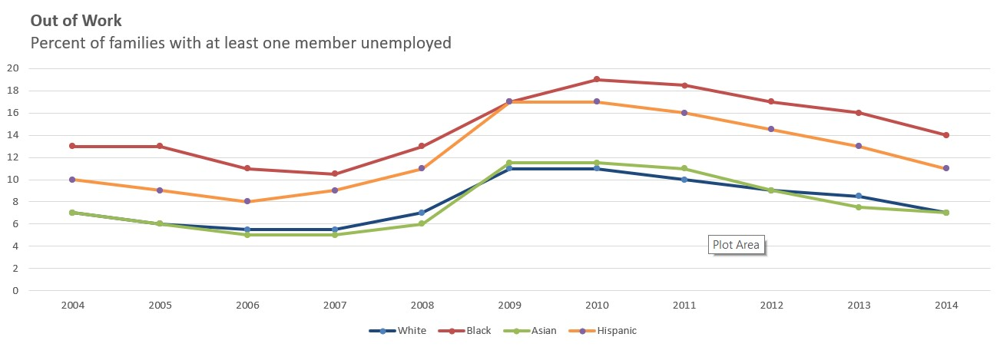
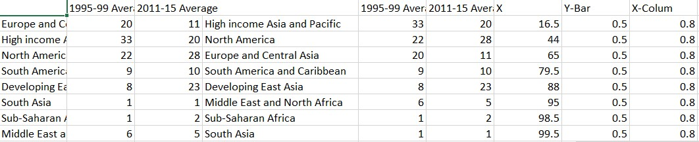
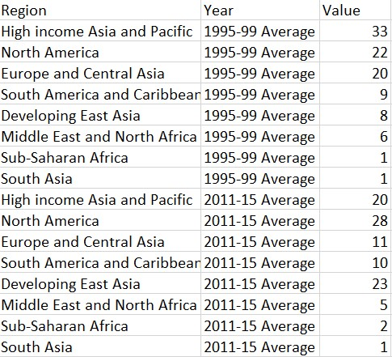
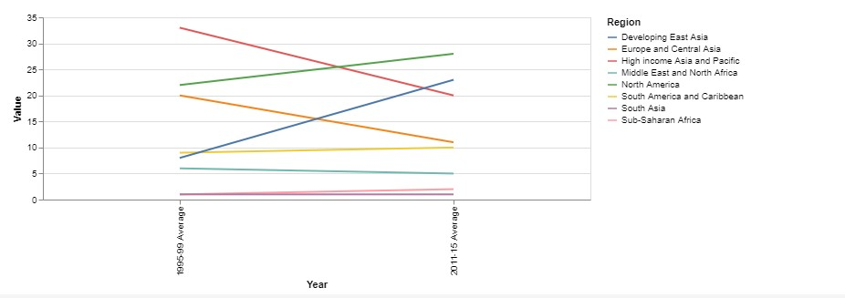
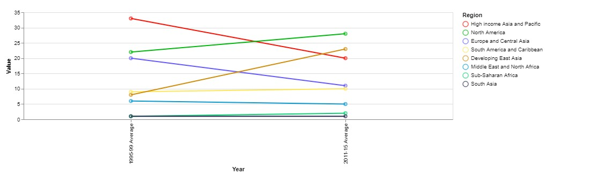

HW 3, CS 625, Spring 2023
================
Prashant Tomar
================
February 16, 2023

## Part 1 - Remake: Paired Column Chart from WSJ

#### Original Chart and Post

|  | article: [Remake: Paired Column Chart from WSJ](https://policyviz.com/2018/03/01/remake-paired-column-chart-from-wsj/) |
|---------------------------------------------------|------------------------------------------------------------------------------------------------------------------------|

#### Analysis

In the post, the writer asked the audience to compare the employment 
rates of four different races both within and between the years 2004 
and 2014. Initially, the writer displayed a bar chart, but later on 
decided to convert it into a line chart. This was a wise decision, 
as Jeffrey Heer, Michael Bostock, and Vadim Ogievetsky state in their 
article "A Tour Through the Visualization Zoo," a time series chart, 
which is essentially a line chart, is the ideal choice for data that 
involves a series of data points that are correlated with time. 
This type of chart enables viewers to easily observe trends and 
make comparisons between data points from different time periods.

#### Recreation

I have also chosen to replicate the line chart in this section. The 
data used in the original post has five columns, beginning with Year, 
followed by White, Black, Asian, and Hispanic. As the data in this 
format can be challenging to map over a chart, I performed some data 
wrangling and reorganized the information into three columns: 
Year, Race, and Value (which represents the employment rate).

#### Steps
1. Select the data you want to graph. Click and drag the cursor over the data range to highlight it.
2. Click on the "Insert" tab in the top menu bar.
3. Click on "Line" in the charts section of the ribbon.
4. Select the type of the line graph you want to create.
5. Excel will automatically createw a line graph based on the data you selected. 
6. Customize the graph by adding titlees and change the colour of line.

##### Limitation

Despite my attempts, I couldn't eliminate the dots on the graph's line using Excel.

## Part 2 - Remake - Pie-in-a-Donut Chart

#### Original Chart and Post

|  | article: [Remake: Pie-in-a-Donut Chart](https://policyviz.com/2018/02/15/remake-pie-in-a-donut-chart/) |
|---------------------------------------------------|--------------------------------------------------------------------------------------------------------|

#### Analysis

The original graph used in this post is a pie chart that compares the 
trade share of the USA with that of various other countries. The data
they used lists the countries alongside their respective trade 
shares in two separate columns, as shown in the image below:

Manually, we will transform this data by consolidating all the values 
into a single column and creating a new column that will contain 
categorical values representing the range of years, as illustrated below:

The writer has presented two different ways of creating the charts: one 
using a slope chart and the other using a stack chart. As I am not 
familiar with slope charts and have not seen them before, I will 
be attempting to recreate the chart using this method.

#### Recreation

A slope chart is essentially a multi-line chart that connects two categorical values. 
Given that the two values represent time data in years, it is logical to use a line 
chart to display this information. I have included the public URL of my 
observablehq notebook, where I began by creating a basic line chart.

The link to my observableHq Notebook
[Notebook](https://observablehq.com/d/b1dff364e66df14f).

    vl.markLine()
      .data(sheet1)
      .encode(
        vl.x().fieldO('Year'),
        vl.y().fieldQ('Value'),
        vl.color().fieldN('Region'),
        vl.tooltip().fieldN('Region')
      )
      .width(600)
      .render()

Afterwards, I conducted an online search to determine how to modify the color of 
individual lines within a slope chart, and I adjusted the code accordingly.

    chart1 = {

    const scale = {
        domain: ['High income Asia and Pacific', 'North America', 'Europe and Central Asia', 'South America and Caribbean', 'Developing East Asia', 'Middle East and North Africa', 'Sub-Saharan Africa', 'South Asia'],
        range: ['#fc0f03', '#00b80c', '#6459ff', '#ffe659', '#d18c0a', '#0a99d1', '#0ad171', '#28284f']
     };

    const line = vl.markLine()
      .data(sheet1)
      .encode(
        vl.x().fieldO('Year'),
        vl.y().fieldQ('Value'),
        vl.color().fieldN('Region').scale(scale),
        vl.tooltip().fieldN('Region')
      )

      return vl
        .layer(line)
        .width(800)
        .render();
    }

Once I modified the line, my goal was to replicate the slope chart precisely, 
with the exception of adding a point at each end of the slope. To achieve this, 
I inserted the points into the same chart layer, resulting in a chart 
that closely resembles the one shared in the post.

    chart = {

    const scale = {
        domain: ['High income Asia and Pacific', 'North America', 'Europe and Central Asia', 'South America and Caribbean', 'Developing East Asia', 'Middle East and North Africa', 'Sub-Saharan Africa', 'South Asia'],
        range: ['#fc0f03', '#00b80c', '#6459ff', '#ffe659', '#d18c0a', '#0a99d1', '#0ad171', '#28284f']
     };

    const line = vl.markLine()
      .data(sheet1)
      .encode(
        vl.x().fieldO('Year'),
        vl.y().fieldQ('Value'),
        vl.color().fieldN('Region').scale(scale),
        vl.tooltip().fieldN('Region')
      )

      const Point = vl.markPoint()
      .data(sheet1)
      .encode(
        vl.x().fieldO('Year'),
        vl.y().fieldQ('Value'),
        vl.color().fieldN('Region').scale(scale),
        vl.tooltip().fieldN('Region')
      )
      return vl
        .layer(line,  Point)
        .width(800)
        .render();
    }

##### Limitation

The only limitation in this chart I see is the label on each slop.

## References

-   A tour through Zoo Visualization,
    <https://queue.acm.org/detail.cfm?id=1805128%20>
-   How to plot two lines on one graph,
    <https://rpubs.com/euclid/343644>
-   Creating Multi Line chart with point chart,
    <https://vega.github.io/vega-lite/docs/line.html>
-   Creating Slop Chart using Vega Lite,
    <https://vega.github.io/vega-lite/examples/line_slope.html>
