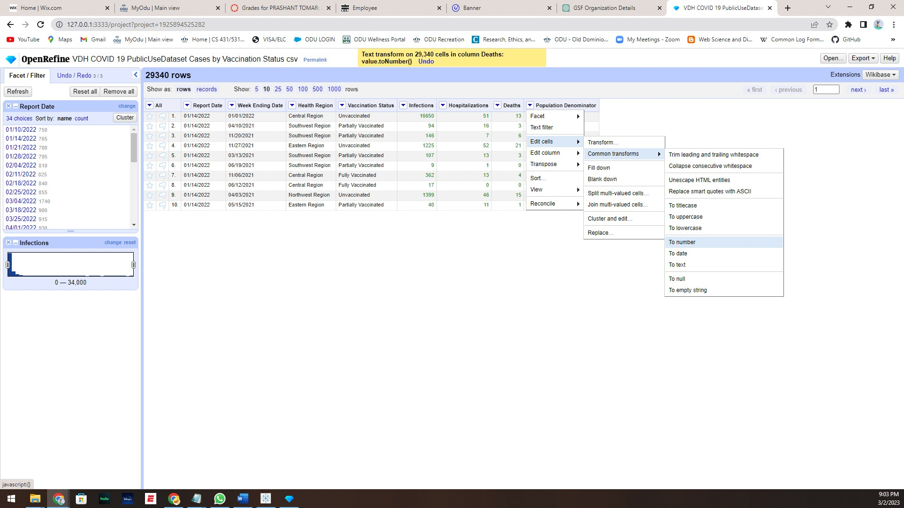
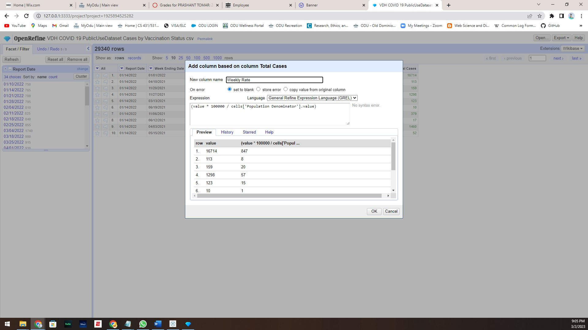

Homework 4: Arrange Tables, CS 625, Spring 2023
================
Prashant Tomar
2/3/2023

#### Part 1. How has the weekly rate of COVID-19 cases in Virginia changed over time based on vaccination status?

##### Data Manipulations

To answer this question, we will be utilizing dataset 1, which contains information on the number of COVID-19 infections, 
hospitalizations, and deaths for each health region in Virginia, categorized by the week of onset/specimen collection 
and by vaccination status. As the dataset contains data from September 2021 to July 2022, we will only be using 
data from the whole table. We will then export the final dataset for further analysis.

To achieve this, we will apply a text facet on the "Report Date" column and "Week Ending Date" column and adding numerical
facet to "Infections" , "Hospitalizations" , "Deaths" and "Population" Denominator columns.

Our next step is to compute the weekly rate of COVID-19 cases in Virginia. To accomplish this,
we will create a new column that derives its values from the existing cases columns using 
the following GREL expression. We will label this new column as "Total Cases," as demonstrated 
in the screenshot below.

    (cells.Infections.value + cells.Hospitalizations.value + cells.Deaths.value)

Our subsequent task is to generate the final column, which is the Weekly Rate column, 
using the formula outlined in the homework description. To achieve this, we will utilize
the following GREL expression and assign the column name as "Weekly Rate."

    (value * 100000 / cells['Population Denominator'].value)

 
Lastly, we will export the file with an xlsx extension and
name it as Dataset1-csv.xlxs, allowing us to utilize it in Tableau for visualization 
purposes, primarily to address the main question.

##### Data Analysis

Upon examining the final dataset, we can observe that it contains approximately 10 attributes. 
Report Date and Week End Date are ordinal attributes, which indicate the time dimension of the
recorded data. Health Region and Vaccination Status are categorical data and can be utilized
to group the records to generate various insights. The remaining attributes, including
Infection, Hospitalization, Death, and Weekly Rate, are quantitative attributes.

As we have been tasked with determining how the weekly rate fluctuates over time based
on vaccination status, we will likely utilize the Week End Date attribute to categorize
the data based on Weekly Rate and Vaccine Status.

##### Data Visualization

In accordance with the "Why" and "How" principles of data visualization explained in 
Visualization Analysis and Design by Tamara Munzner, we will determine the most appropriate
chart idiom that can best illustrate the answer to the question asked in Part 1. As the
question primarily concerns identifying the weekly rate that changes over time based on 
Vaccine Status, it is clear that we need a chart that can visualize the relationship 
between time and the weekly rate.

In light of this, we require one ordinal attribute and one quantitative attribute 
that can answer the "What" part of the framework. This leads us to utilize a Horizontal
Bar Chart as it can display trends in the data over time. For the "Why" part of the framework,
we will use a Horizontal Bar as we need to identify trends in the data. For the "How" part 
of the framework, we will use the Week ending Date as x-axis, and the y-axis
is the weekly rate. We will also use the Vaccine Status attribute to Bars on 
the chart to demonstrate the changes in trends for each vaccine status 
simultaneously. The chart's illustration is shown below.

We have used Tableau, to develop the chart.

##### Further Analysis

The above chart, as you can see from December 2021 weekly rate of
Vaccination  cases it was around 65000 and then gradually decreases till May 2022, but there was a sudden increase in the rate from June and reaches
to its peak on July 2022 that is around 150000. This analysis
using the above visualization have answered the question easily.
I've also attached the Tableau Workbook in the repository.

#### Part 2. For each health district in Virginia, what proportion of all 1st doses were of the Pfizer vaccine?

##### Data Manipulations

We will be utilizing Dataset 2 to answer this question, which contains information about the number
of COVID-19 vaccine doses administered for each locality in Virginia by administration date and
by facility type. The data includes a Vaccine Type attribute that contains several options, 
including Pfizer, Moderna, Astrazeneca, and J&J, along with the Dose Number attribute that 
specifies which dose was administered that day.

For example, on November 11th, 2021, Peninsula Newport News administered 11 doses of 
Pfizer vaccine, dose 3. We need to determine the proportion of Pfizer vaccines 
from the total vaccines administered in each health district, we will need to group the 
data by health district and calculate the total number of vaccines administered for 
dose 1 and the total number of Pfizer vaccines administered for dose 1. By doing 
this, we can find the proportion of Pfizer dose 1 vaccines.

Before proceeding with data manipulation, we need to clean the data by removing
records with missing information such as health district or vaccine type. 
To accomplish this, we can use OpenRefine to open the dataset and apply a 
text facet on the Health District and Vaccine Type columns. This will allow 
us to easily identify any items with missing or incomplete information,
which can then be removed from the datase

 As you can see when we applied text facet on
Health District, we found that there are two Health district with name
**Not Reported** and **Out of State** are there, that we need to remove.
we are removing Out of State data as we need to show the insight only
related to Virginia. Now we will export the data into xlxs so that we
can further do manipulation on it using python as we need to aggregrate
the data with respect to district and calculate proportion.

We have used Google Colab to perform python operations for data
manipulations. [Colab Notebook
URL](https://colab.research.google.com/drive/1BDm043bZl6ANYybvw234S8Jnm8Z1OiUN#scrollTo=0zhRxx33zwL4)

Initially, we'll upload the VDH-COVID-19-PublicUseDataset-Vaccines-DosesAdministered-csv.csv file into the Colab Notebook and import the 
Pandas library. We'll use the Pandas' Dataframe feature to manipulate the data. 
Once the data is uploaded to Google Colab, we'll use the read_csv function of
Pandas to import the csv data into the dataframe. Then, we'll filter the data 
based on Doze 1 as we are only interested in finding the proportion for Doze 1.

    import pandas as pd
    data = pd.read_csv('VDH-COVID-19-PublicUseDataset-Vaccines-DosesAdministered-csv.csv')

    data = data[data['Dose Number'] == 1]

After filtering and storing the data in a global variable data, we will
create two new variables. One variable will group the data by district 
and calculate the total sum of all administered vaccines. The second variable 
will group the data by district and calculate the total sum of Pfizer vaccines
administered. After creating these variables, we will use the pandas merge
function to combine the two dataframes based on the district column. As a 
result, we will have two new columns side by side, one for the total number
of vaccines administered and the other for the total number of Pfizer vaccines 
administered, grouped by district.

    data_all = data.groupby(['Health District']).agg(all_count=('Vaccine Doses Administered Count', 'sum')).reset_index()

    data_pfizer = data[data['Vaccine Manufacturer'] == 'Pfizer']
    data_pfizer_all = data_pfizer.groupby(['Health District']).agg(pfizer_count=('Vaccine Doses Administered Count', 'sum')).reset_index()
    final_data = pd.merge(data_all, data_pfizer_all)

Once the data has been merged, we can create a new attribute to calculate the
proportion of Pfizer 1st doses. To do this, we will divide the total sum of 
Pfizer 1st doses by the total sum of all doses and then multiply it by 100 
to get the percentage. Finally, we can export the data into a separate file
using the to_csv function of pandas so that we can start working on the visualization part.

    final_data['pfizer_propotion'] = (final_data['pfizer_count'] / final_data['all_count']) * 100

    final_data.to_csv('final_dataset_2.csv')
    
    files.download("final_dataset_2.csv")

##### Data Analysis

The final_dataset_2.csv file generated through the previous steps contains 3 
main attributes: Health District, all_count, pfizer_count, and pfizer_proportion. 
Health District is a categorical attribute, while the other two are quantitative.
Our task is to determine the proportion of all the 1st doses of vaccines that were
Pfizer in each Health District. Therefore, we will likely use the Health District
attribute and the Pfizer proportion column.

##### Data Visualization

In Part 2, we need to create a chart to show the proportion of Pfizer vaccines in 
the overall count of first doses administered, with respect to each health district. 
To do this, we will use a bar plot with the health district on the x-axis and the
proportion of Pfizer and the remaining count on the y-axis.

In the final_dataset_2.csv file, I have added a column to calculate the difference
between 100 and the Pfizer proportion, which represents the proportion of the remaining
vaccines used for the first dose. I have also created a stacked bar chart in Tableau and
ordered the data by Pfizer proportion for better understanding of the distribution in each district.

The chart will help us to understand the Pfizer proportion in the overall count of
first doses administered, as well as the proportion of the remaining vaccines 
used for the first dose, in each health district.

##### Further Analysis

The chart uses lines as marks to represent the proportion on the y-axis and 
color as a channel to differentiate between Pfizer and non-Pfizer vaccines. 
It effectively answers the question by providing a clear visualization of the
distribution for each district. Additionally, by ordering the data based on
Pfizer proportion, one can easily see the minimum and maximum proportion at 
which Pfizer was utilized. For example, in Eastern Shore, the proportion of 
Pfizer is much lower compared to other districts, whereas in Fairfax, Pfizer 
is mostly utilized.

I've also attached the Tableau Workbook in the repository.

#### Part 3. Propose two questions that require data from dataset 1 and dataset 2 to be combined to answer?

Before we delve into the question, let's take a step back and examine the original dataset.
The second dataset provides information about daily vaccination records in each health 
district, including the type of vaccine administered and the dose sequence 
(i.e., first, second, or third dose). Meanwhile, the first dataset contains information
about the number of cases in each region, including infections, hospitalizations, and deaths.
It's important to note that all the data pertains to the state of Virginia. By using 
the Virginia Health District, Region, and Localities data provided in the homework 
description, we can combine the datasets to derive meaningful insights.

##### Insight \# 1 : Correlation between vaccine administered and total cases with respect to each month.

The objective of the question is to identify the correlation between the total 
number of cases and the total number of vaccines delivered in each month. 
This analysis would provide valuable insights into the effectiveness of the 
vaccines, and enable us to make forecasts for the future based on the quantity 
of vaccines delivered. This information can prove to be beneficial for hospitals.

We can filter the health district from the first data set based on the 
provided Virginia Health District, Region, and Localities, and combine 
it with the total cases from the second data set and total vaccines delivered
from the first data set by grouping them by month and summing all quantitative
values. This will give us attributes such as Month, Total Vaccines Delivered,
and Total Cases. A scatter plot is the best way to display the relationship 
between two quantitative attributes. I have created a sketch of the plot, which is shared below.

##### Insight \# 2: Find the total sum of vaccine delivered with respect to each region.

We will apply a similar approach as used in Insight # 1 to extract and filter 
only the data related to vaccine delivery and region, and create a separate dataset. 
This will allow us to determine the total number of vaccines delivered in each region.
The dataset will have one categorical attribute, i.e. region, and one numerical value,
i.e. total vaccines delivered. We will use a bar plot to represent this data, as the
total vaccine delivered is a measured value. We will use a line mark to represent the 
measured quantity over the y-axis and use the regions on the x-axis, as shown in the sketch below.

## References
-   What, Why & How framework,
    <https://learning.oreilly.com/library/view/visualization-analysis-and/9781466508910/K14708_C001.xhtml#fig-ch01_7>

-   Pandas operations,
    <https://pandas.pydata.org/docs/reference/api/pandas.DataFrame.merge.html>

-   Arrange Tables Example,
    <https://github.com/odu-cs625-datavis/spring23-hw4-Badjedi04/blob/master/README.md>
-   General Refine Expression Language,
    <https://docs.openrefine.org/manual/expressions#grel-general-refine-expression-language>

-   Open Refine , <https://openrefine.org/>

-   Regex Development, <https://regex101.com/>

