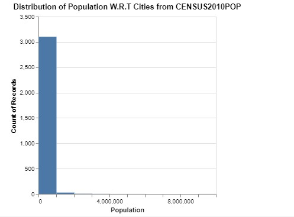

Homework 5: Analyzing Data Using Distribution Charts
================
Prashant Tomar
Mar 23, 2023

### Part 1: Create Distribution Charts

#### Data Manipulations

We have chosen Dataset 1, specifically the CO-EST2019-alldata from the US Census Bureau, which contains
yearly recorded data on population, including birth and death counts, for every county in the United States.
The population values are currently distributed across different columns, so we plan to convert them into 
rows in order to create a box plot and other distribution charts.

We used Python to manipulate the data by converting the value columns into rows. During this process,
we noticed that the data had a sum of population with respect to States, which we removed from the 
main file to plot values with respect to counties.

To create the three glyphs for the box plot (CENSUS2010POP, POPESTIMATE2015, and POPESTIMATE2019), 
we filtered the data to select only these columns and created a new dataset that also included the 
State and County names. We then used the pandas melt function to pivot the values with respect to 
States and Counties. The implementation code for this can be found below.

``` p
import pandas as pd

# read in the original dataset
data = pd.read_csv('co-est2019-alldata.csv', encoding='latin1')

# drop rows that are aggregate with respect to States
data.drop(data[data['STNAME'] == data['CTYNAME']].index, inplace=True)

# save the modified dataset to a new CSV file
data.to_csv('original_dataset.csv')

# select only the required columns
data = data[['STNAME', 'CTYNAME', 'CENSUS2010POP', 'POPESTIMATE2015', 'POPESTIMATE2019']]

# convert the value columns to rows
data = data.melt(id_vars=['STNAME', 'CTYNAME'], var_name="Year", value_name="Population")

# sort the data by population in descending order
data = data.sort_values(by=['Population'], ascending=False)

# save the modified dataset to a new CSV file
data.to_csv('final_dataset.csv')
```

#### Data Visualization

##### Box Plot

We will now focus on visualizing the data. To create our chart, we utilized Vega-Lite APIs.
Our task was to produce a box plot chart that displays the distribution of three population 
attributes recorded at different times. The code for this chart can be found in our 
observablehq notebook.

    vl.markBoxplot()
      .title("Population of Cities In Unites States (2010 Census, Population Estimates of 2015 & 2019)")
      .data(data)
      .encode(
        vl.x().fieldO('Year').title("Population Estimates & Census"),
        vl.y().fieldQ('Population').title("Population"),
        vl.color().fieldN('Year').legend(null),
      )
      .width(300)
      .render()
  
To create a box plot, we need to plot one set of quantitative data and one set of categorical data.
We defined a variable that includes the values 'CENSUS2010POP', 'POPESTIMATE2015', and 'POPESTIMATE2019',
and a value that represents the recorded population value. The resulting box plot will be similar to the following:


##### Observation

In the chart, we can observe that there is an outlier in each of the three duration of recordings,
and due to the high values, the median values are not easily visible. In order to obtain a clearer
picture, we have performed some data manipulation by creating a new dataset that excludes values 
greater than the third quartile and less than the second quartile. By filtering out values above 
75% and below 25%, we can now easily see the median values. Below is the Python script used for 
this data manipulation.

``` p
# remove the 3rd and 2nd Quartiles from the data
data.drop(data[data['Population'] > (data['Population'].max() * 0.75)].index, inplace=True)
data.drop(data[data['Population'] < (data['Population'].max() * 0.25)].index, inplace=True)

# save the modified dataset to a new CSV file
data.to_csv('final_dataset_without_outliers.csv')
```

After applying the filtering process, we stored the resulting data in separate files so
that we could use the original dataset for further plots. By plotting this filtered data, 
we can now clearly observe the median values.


From the chart above, it is evident that the median values are around 2 million. 
This chart has the advantage of allowing us to easily identify outliers. 
However, due to the large values, we are unable to see the median, lower 
quartiles, and outliers all at once.

##### Histogram

Next, we will use the same data as before, but with the second and third quartiles removed.
This time, we will plot a histogram to observe the further distribution, but we will only
select the CENSUS2010POP variable to check the distribution of population. To filter out 
only the CENSUS2010POP data, we used the transform method from the Vega-Lite API. 
The code for Vega-Lite can be found below.

    vl.markBar()
      .title("Distribution of Population W.R.T Cities from CENSUS2010POP")
      .data(data)
      .transform(vl.filter("datum.Year === 'CENSUS2010POP'"))
      .encode(
        vl.x().fieldQ('Population').bin({'maxbins':10}).title('Population'),
        vl.y().aggregate('count'),
      )
      .width(300)
      .render()

Result of this is shown as below,



##### Observation

The histogram clearly shows the distribution of counties with respect to their population, 
with a large portion of counties having populations between 0 and 2 million. The bin size
selected was 10. We also observed that there is a very small proportion of counties with 
populations above 2 million. However, as the purpose of a histogram is to show distribution 
in an effective way, this distribution does not appear to be very informative. Therefore, 
we will further analyze the distribution among counties with populations less than 2 million.
To accomplish this, we used the transform function from the Vega-Lite API to filter out records
with populations less than 2 million and plotted the resulting values. The resulting plot is shown below.

    vl.markBar()
      .title("Distribution of Population W.R.T Cities from CENSUS2010POP")
      .data(data)
      .transform(vl.filter("datum.Year === 'CENSUS2010POP'"), 
                 vl.filter("datum.Population < 200000"))
      .encode(
        vl.x().fieldQ('Population').bin({'maxbins':10}).title('Population'),
        vl.y().aggregate('count'),
      )
      .width(300)
      .render()


The new plot shows that counties with populations less than 2 million are more evenly
distributed across different population sizes. This makes it easy to understand the 
distribution. However, it is important to note that changing the bin size and data
filtration may be necessary to achieve the best possible distribution, and we still
cannot be certain if the distribution is perfect.

##### ECDF

We will be using the same dataset as before to create a new chart. This time, we will
use the Vega Lite API to create an empirical cumulative distribution frequency chart.
The code for this chart can be found in our ObservableHQ notebook.

    vl.markLine().
      data(data)
      .title('ECDF for Population of Cities in United States')
      .transform({
      "sort": [{"field": "Population"}],
        "window": [{"op": "cume_dist", "field": "count", "as": "Function"}],
        "frame": [null, 0],
      },vl.filter("datum.Year === 'CENSUS2010POP'")
      )
      .encode( 
        vl.x().fieldQ("Population").title('Population'),
        vl.y().fieldQ("Function").title("Func\(Population\)")
      ).render();

In the above image, we have applied a filter to only show data related to CENSUS2020POP
using the Vega Lite API. The resulting chart can be seen below.


##### Observation

The distribution of the population can be easily observed from the above chart which
shows the distribution from the lowest to the highest values. Since the population 
is mainly around 2 million, the chart is concentrated at the edges. This chart has 
the advantage of showing the sequence of distribution.

In my opinion, the most suitable visualizations for this dataset are the histogram 
and box plot as they provide clear insights into the data distribution.

### Part 2: Further Analysis

##### State-wise population

The next step is to examine the provided data and the charts we have generated in more detail.
As we observed in part 1's histogram, the distribution is skewed towards counties with a 
population of 2 million or less, but there are relatively few counties with a population
greater than 2 million. We will investigate which states are responsible for this using 
a bar chart, but first we need to manipulate the original data to calculate the population
for each state. The following is the code for this manipulation:

``` p
# select only the rows where STNAME is equal to CTYNAME
dataset = pd.read_csv('co-est2019-alldata.csv', encoding='latin1')
dataset = dataset[dataset['STNAME'] == dataset['CTYNAME']]

# sort the data by CENSUS2010POP in descending order
dataset = dataset.sort_values(by=['CENSUS2010POP'], ascending=False)

# save the modified dataset to a new CSV file
dataset.to_csv('dataset_state_population.csv')
```

A new dataset was generated specifically for this purpose, which was then utilized to 
construct a box plot. Additionally, the data was organized in a manner that allows
for easy identification of the states with lower population as well as the outliers.


    vl.markBar()
      .data(org_data)
      .encode(
        vl.y().fieldQ('CENSUS2010POP').title('Population'),
        vl.x().fieldN('STNAME').sort({'field':'CENSUS2010POP'}).title('State'),
        vl.color().fieldN('STNAME').legend(null),
        vl.tooltip([
          vl.y().fieldQ('CENSUS2010POP').title('Population'),
          vl.x().fieldN('STNAME').title('State'),
        ])
      )
      .title({
        text:'Population in The United States',
        subtitle:"Population in United States for Each States",

      })
    .render()


##### Observation

Certain states such as California, Texas, New York, Florida, and Ohio have significantly
high populations and are likely to be the cause of outliers in the box plot. 
The remaining states do not have as large of an impact and thus do not affect 
the display of median values.

##### Counties with a population exceeding 2 million

Next, we will conduct further analysis. As a reminder, in the first part of the analysis 
during the histogram section, we were interested in exploring the distribution of 
counties with populations around 2 million. We will now shift our focus to counties 
with populations greater than 2 million and utilize the same code, modifying the
filter from "less than" to "greater than." This will enable us to observe the 
distribution of counties with populations exceeding 2 million.

    vl.markBar()
      .title("Distribution of Population of Cities from CENSUS2010POP")
      .data(data)
      .transform(vl.filter("datum.Year === 'CENSUS2010POP'"), 
                 vl.filter("datum.Population > 1000000"))
      .encode(
        vl.x().fieldQ('Population').bin({'maxbins':10}).title('Population'),
        vl.y().aggregate('count'),
      )
      .width(300)
      .render()


##### Observation

It is noteworthy that there are approximately 35 counties in the United States that have
a population of over 2 million, and there is just one county with a population of around
9 million.

##### Trends in state populations

The initial data we used contains population records from 2010 to 2019. Our next 
step is to manipulate the complete dataset by transforming it into a temporal and
ordinal dataset. We will then analyze the trends using a line chart. Below is 
the code for performing this manipulation.

```p
# select only the rows where STNAME is equal to CTYNAME and select the required columns
dataset_1 = pd.read_csv('co-est2019-alldata.csv', encoding='latin1')
dataset_1 = dataset_1[dataset_1['STNAME'] == dataset_1['CTYNAME']]
dataset_1 = dataset_1[['STNAME', 'POPESTIMATE2010', 'POPESTIMATE2011', 'POPESTIMATE2012', 'POPESTIMATE2013', 'POPESTIMATE2014', 'POPESTIMATE2015', 'POPESTIMATE2016', 'POPESTIMATE2017', 'POPESTIMATE2018', 'POPESTIMATE2019']]

# convert the value columns to rows
dataset_1 = dataset_1.melt(id_vars=['STNAME'], var_name="Year", value_name="Population")

# sort the data by population in descending order
dataset_1 = dataset_1.sort_values(by=['Population'], ascending=False)

# save the modified dataset to a new CSV file
dataset_1.to_csv('dataset_pivot_popest.csv')
```

Now we will use the data to plot in vega lite line chart, as shown
below,

    vl.markLine({point:{size:50}})
      .data(pop)
      .encode(
        vl.x().fieldO('Year'),
        vl.y().fieldQ('Population'),
        vl.color().fieldN('STNAME'),
        vl.tooltip([
          vl.x().fieldO('STNAME'),
          vl.y().fieldQ('Population')
        ])
      )
      .width(400)
      .render()


##### Observation

Upon examining the trend chart, I have noticed that only four states, namely New York, 
California, Texas, and Florida, have significant changes in trends, whereas the trends 
for the remaining states are relatively stable.

##### Correlation finding between the Population and Birth Rate

The dataset also includes records for the number of births per year in each county. 
We will perform data manipulation to extract the necessary columns and determine the
correlation between the birth count and population for each state. This will help us
identify if there is any significant relationship between the two variables. The
following code shows the data manipulation steps.

```p
# select the required columns and sort the data by POPESTIMATE2019 in descending order
birthdata = pd.read_csv('co-est2019-alldata.csv', encoding='latin1')
birthdata.drop(birthdata[birthdata['STNAME'] == birthdata['CTYNAME']].index, inplace=True)
birthdata = birthdata[['STNAME', 'CTYNAME', 'POPESTIMATE2019', 'BIRTHS2019']]
birthdata = birthdata.sort_values(by=['POPESTIMATE2019'], ascending=False)

# save the modified dataset to a new CSV file
birthdata.to_csv('dataset_birthdata.csv')
```

To determine the correlation between two numeric variables, we will use a scatter plot
created using the Vega-Lite API. We will focus on data from the year 2019 and plot 
the population count on the y-axis and the birth count on the x-axis. Here is the
code for implementing the scatter plot.

    vl.markPoint().data(birthdata).encode(
      vl.x().fieldQ('BIRTHS2019'),
      vl.y().fieldQ('POPESTIMATE2019'),
      vl.color().fieldN('CTYNAME'),
      vl.tooltip(['CTYNAME', 'POPESTIMATE2019','BIRTHS2019']) // show the Name and Origin fields in a tooltip
    ).render()


##### Observation

As evident from the chart above, we have identified a linear regression, indicating that the
birth count is dependent on the population. In other words, as the population increases, 
the birth count also increases.

### Observable Hq Notebook

[ObservableHq Notebook
URL](https://observablehq.com/d/62cecc956c203f91)

## References

-   What, Why & How framework,
    <https://learning.oreilly.com/library/view/visualization-analysis-and/9781466508910/K14708_C001.xhtml#fig-ch01_7>

-   Observablehq Tutorial, <https://observablehq.com/tutorials>

-   Vega lite API,
    <https://observablehq.com/collection/@vega/vega-lite-api>
    
-   Pandas operations,
    <https://pandas.pydata.org/docs/reference/api/pandas.DataFrame.merge.html>

-   Arrange Tables Example,
    <https://github.com/odu-cs625-datavis/public/blob/main/Spr23/Wk4-Arrange-Tables-examples.md>
