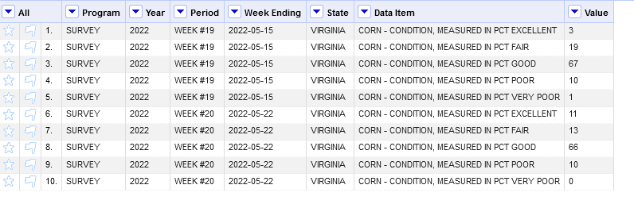

Homework 6: Project - Initial Dataset Exploration
================
Prashant Tomar
Apr 02 , 2023

### Step 1: Choose a Dataset

#### Dataset 1

##### Data related to agriculture that originates from the United States Department of Agriculture.

I've chosen agricultural information from the United States Department of Agriculture for my project.
This data includes details about the harvest, yield, production, and quality of various crops in
different regions and states, organized by date. We'll be analyzing this data alongside weather
data from the corresponding dates and states to look for correlations.

We will utilize the subsequent characteristics/qualities for the agricultural data.

1.  Week Ending
2.  Year
3.  State
4.  Data Item
5.  Program
6.  Value
7.  Commodity (Corn)

Reference of the website is, <https://quickstats.nass.usda.gov/results/7D6D98FF-34E8-3B30-B447-7614CDC48C44>

### Part 2: Further Analysis

##### Data Manipulation

To investigate and uncover valuable insights, we'll begin with analyzing the agricultural survey
data obtained from the United States Department of Agriculture. We'll narrow down the dataset to
focus only on data related to the quality of Corn crops. The dataset will include the subsequent attributes:

1. The year (in a time series)
2. The period (week numbers within the series)
3. The state (categorical)
4. The commodities (categorical)
5. The data item (categorical), such as "Good Quality" or "Excellent Quality"
6. The value represented as a percentage (numeric).

The dataset will look something like in the below shared screen,

As we discussed in the chapter on Exploratory Data Analysis from R for Data Science, 
there are no hard and fast rules for exploring data. However, one effective way to
uncover interesting information is to distribute the data based on categorical variables. 
To do this, we'll filter the data by state. Since we want to 
display quality data based on states, we'll average the percentage of excellent quality
and present it as a bar chart. The resulting dataset, after grouping and averaging, 
will resemble the following:

After plotting the chart in bar plot we will get something like this,

Our initial plot, which displayed the distribution of the average percentage of excellent
crop quality, led us to ask our first question: "What is the distribution of excellent 
quality based on state?" By examining the visualization, we can see that Wisconsin had 
the highest average excellent quality. We can also verifythis information by conducting
online research, which reveals that Wisconsin , Kansas and Ohio are the top producers of Corn crops in the United States.

As we continue to explore our data, we're beginning to generate more ideas. After
examining the distribution of excellent quality percentage for corn crops based 
on states, we're interested in viewing the overall distribution from previous years
and comparing values between different states. To accomplish this, we'll refer to 
Tamara Munzner's book, "Data Visualization", specifically the chapter on "Why, What,
and How" questions.The most suitable chart for visualizing
trends with two categorical variables and one numeric variable is a continuous area-chart.

Now we will plot the chart in continuous area-chart, the result of it is
shown below,

The plot above reveals that Wisconsin has consistently maintained its quality over the years, 
and it has even been improving. This is the primary reason why it has the highest percentage
of excellent quality in the bar plot. On the other hand, Ohio exhibits high variation in
quality. There is a sharp decline in quality from 2011-2012, but there is a sudden increase
in the percentage of excellent quality, which becomes the highest among all the states. This 
sudden shift in quality could explain why Ohio ranks second in the bar plot.

The analysis can be further extended since there are other variables apart from quality 
to consider. We will conduct a more in-depth analysis to gain a better understanding of the data.

## References

-   What, Why & How framework,
    <https://learning.oreilly.com/library/view/visualization-analysis-and/9781466508910/K14708_C001.xhtml#fig-ch01_7>
-   Arrange Tables Example,
    <https://github.com/odu-cs625-datavis/public/blob/main/Spr23/Wk4-Arrange-Tables-examples.md>
-   United States Dept of Agriculture,
    <https://quickstats.nass.usda.gov/>
-   Open Refine Tutorial,
    <https://openup.org.za/blog/openrefine-aggerate-tutorial>
-   Tableau Tutorial,
    <https://www.tutorialspoint.com/tableau/index.htm>
-   Dataset,
    <https://quickstats.nass.usda.gov/>
-   Regular Expressions,
    <https://openrefine.org/docs/manual/expressions>
