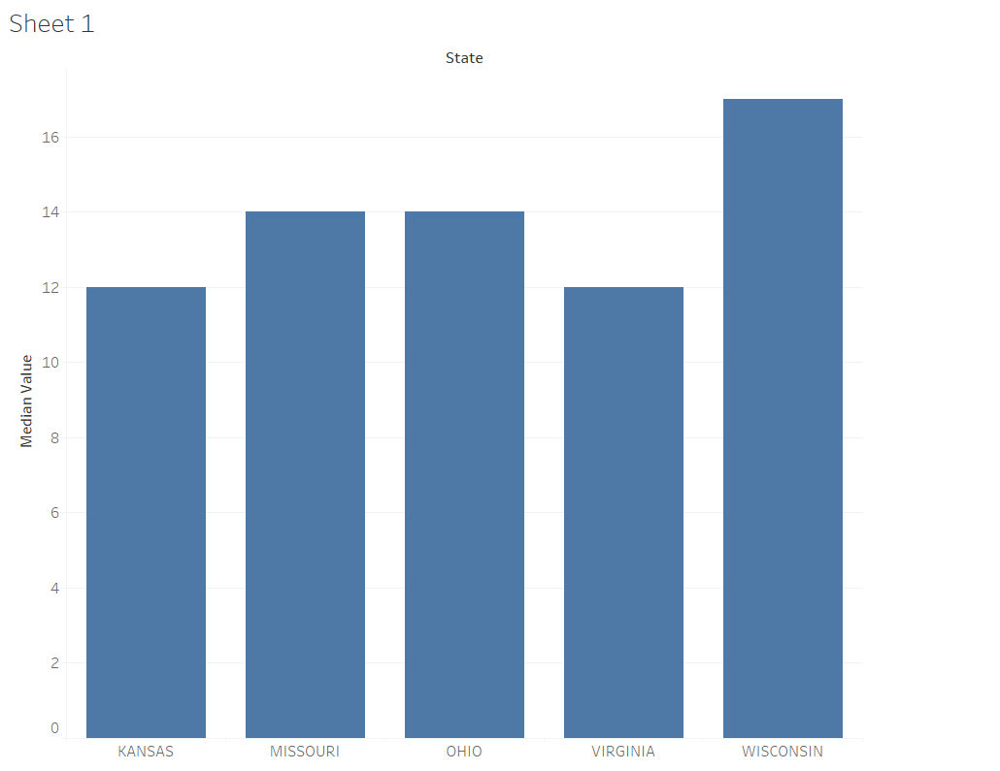
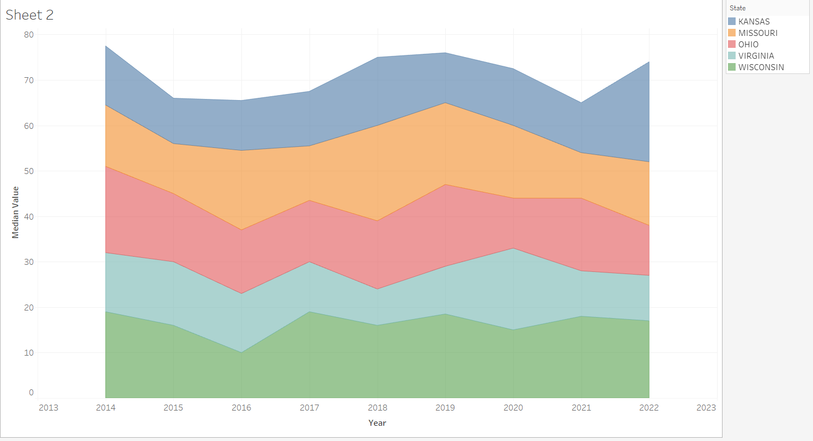
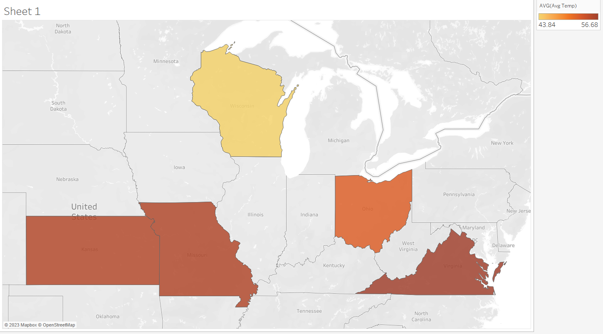
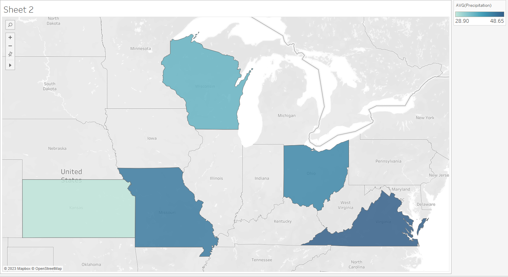
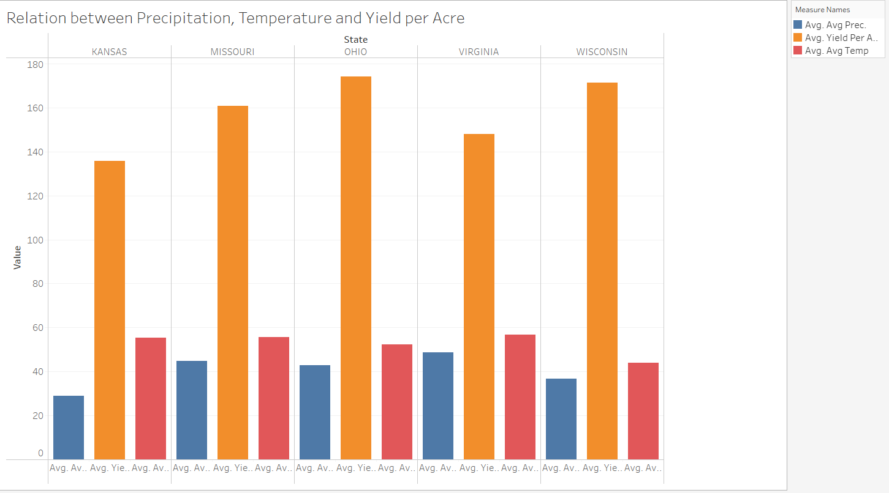
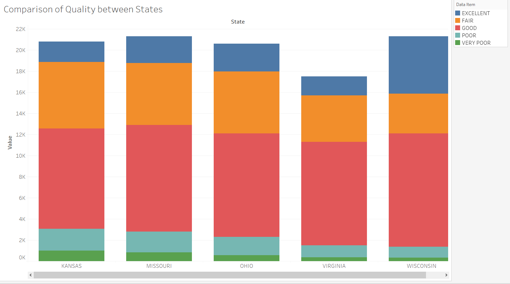
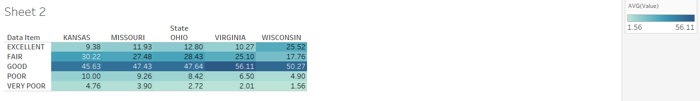
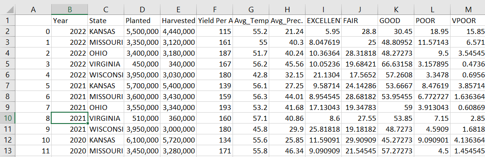

Homework 8: Project - Implement Final Chart
================
Prashant Tomar
Apr 20 , 2023

### Step 1: Choose a Dataset

#### Dataset 1

##### Data related to agriculture that originates from the United States Department of Agriculture.

I've chosen agricultural information from the United States Department of Agriculture for my project.
This data includes details about the harvest, yield, production, and quality of various crops in
different regions and states, organized by date. We'll be analyzing this data alongside weather
data from the corresponding dates and states to look for correlations.

We will utilize the subsequent characteristics/qualities for the agricultural data.

1.  Week Ending
2.  Year
3.  State
4.  Data Item
5.  Program
6.  Value
7.  Commodity (Corn)

Reference of the website is, <https://quickstats.nass.usda.gov/results/7D6D98FF-34E8-3B30-B447-7614CDC48C44>

##### Weather Data from www.ncei.noaa.gov

For weather data, we will use www.ncei.noaa.gov website to get the
historical data of different states that we want. The website contains a
lot of attributes both categorical and numerical. We will use following
attributes to correlate.

1.  Data (Year)
2.  Value (Temperature)
3.  Anomaly (Temperature)
4.  Value (Precipitation)
5.  Anomaly (Precipitation)

### Part 2: Analysis

##### Data Manipulation

To investigate and uncover valuable insights, we'll begin with analyzing the agricultural survey
data obtained from the United States Department of Agriculture. We'll narrow down the dataset to
focus only on data related to the quality of Corn crops. The dataset will include the subsequent attributes:

1. The year (in a time series)
2. The period (week numbers within the series)
3. The state (categorical)
4. The commodities (categorical)
5. The data item (categorical), such as "Good Quality" or "Excellent Quality"
6. The value represented as a percentage (numeric).

The dataset will look something like in the below shared screen,

As we discussed in the chapter on Exploratory Data Analysis from R for Data Science, 
there are no hard and fast rules for exploring data. However, one effective way to
uncover interesting information is to distribute the data based on categorical variables. 
To do this, we'll filter the data by state. Since we want to 
display quality data based on states, we'll average the percentage of excellent quality
and present it as a bar chart. The resulting dataset, after grouping and averaging, 
will resemble the following:

After plotting the chart in bar plot we will get something like this,

Our initial plot, which displayed the distribution of the average percentage of excellent
crop quality, led us to ask our first question: "What is the distribution of excellent 
quality based on state?" By examining the visualization, we can see that Wisconsin had 
the highest average excellent quality. We can also verifythis information by conducting
online research, which reveals that Wisconsin , Kansas and Ohio are the top producers of Corn crops in the United States.

As we continue to explore our data, we're beginning to generate more ideas. After
examining the distribution of excellent quality percentage for corn crops based 
on states, we're interested in viewing the overall distribution from previous years
and comparing values between different states. To accomplish this, we'll refer to 
Tamara Munzner's book, "Data Visualization", specifically the chapter on "Why, What,
and How" questions.The most suitable chart for visualizing
trends with two categorical variables and one numeric variable is a continuous area-chart.

Now we will plot the chart in continuous area-chart, the result of it is
shown below,

The plot above reveals that Wisconsin has consistently maintained its quality over the years, 
and it has even been improving. This is the primary reason why it has the highest percentage
of excellent quality in the bar plot. On the other hand, Ohio exhibits high variation in
quality. There is a sharp decline in quality from 2011-2012, but there is a sudden increase
in the percentage of excellent quality, which becomes the highest among all the states. This 
sudden shift in quality could explain why Ohio ranks second in the bar plot.

The analysis can be further extended since there are other variables apart from quality 
to consider. We will conduct a more in-depth analysis to gain a better understanding of the data.

### Part 3: Further Analysis

#### Creating a chart that displays the average temperature of every state

We will begin the process of correlation by incorporating a dataset on weather. 
Since weather conditions can significantly affect crop yields, production,
and quality, we will analyze various weather features for each state. To
do this, we will extract the annual average temperature and precipitation
data from the weather dataset. Once we have this data, we will create a
Map Chart to visualize each attribute (Average Temperature and Precipitation)
for each state, using the hue as a channel to indicate the severity of these attributes.

The previous chart shows
that Ohio and Wisconsin exhibit a moderate temperature in comparison to
Kansas, and Virginia. In contrast, Virginia and Missouri
experience extreme temperature in comparison to the other states.

#### Creating a visualization of the precipitation levels for each state.

Now we will plot all precipitation for each state on the map chart,

 After examining both
charts, it is evident that Wisconsin experiences a moderate level of
temperature and good precipitation. Since corn crops require a significant
amount of water, they are usually grown in areas with warm and moist
weather conditions. Hence, Wisconsin is a favorable location for corn
cultivation, which explains why the state has a high production of 
excellent quality corn, as shown in Part 2 of the analysis.

#### Measuring Yield for Each State

As mentioned in Part 2, we will now examine additional factors related
to corn farming in our further analysis. Specifically, we will investigate
the relationship between yield per acre and weather conditions. To do
this, we will create a chart showing the yield per acre in each state 
for each year, in order to identify any patterns or trends. But 
we can create this chart, it's important to understand what this
metric means. Yield per acre is a measure used to calculate the 
amount of harvested raw goods obtained from one acre of land.

It appears that Virginia has the lowest yield compared to other 
states, which is understandable given the extreme weather conditions
shown in the previous map charts where both temperature and 
precipitation are not constant. Additionally, the quality of corn in 
Virginia is also poor according to the excellent quality chart 
discussed in part 2.

#### Establishing a relationship between Yield Per Acres and Precipitation

We will now merge the two datasets using the Year and State columns
as keys. Specifically, we will use precipitation data from the 
weather dataset and Yield Per Acres data from the Corn crop dataset
and create a stacked-bar chart. The resulting dataset will have a structure like this:

We will place yield per acres on y-axis and precipitation on x-axis.

The data shows that when there is a high amount of precipitation, 
the yield per acre is higher. This can be attributed to the fact that
excessive water can sometimes be used to harvest the plant for better growth.

#### Comparing the Condition of Corn Crops Across States

After analyzing the quality and weather conditions, we can now 
compare the distribution of conditions among different states. 
To do this, we used the same data that was used to plot the 
distribution of Excellent quality in Part 1. However, we used
the entire dataset to compare the conditions of each state
with respect to the percentage values of Excellent, Good, 
Fair, Poor, and Very Poor. Bar charts were used to show the comparison.

This chart shows that the majority of the percentage distribution lies
in the Good condition category for Corn crops. However, based on our 
previous analysis, we discovered that Ohio and Wisconsin are ideal 
for Corn crop cultivation. Therefore, it is noteworthy that these two
states are also leading in the Excellent category.

We attempted to gain more insights by using a square stacked bar chart, which
provides an overview of all the conditions.

### Part 4: Developing and improving the final chart

In this section, we will proceed with analyzing and improving the chart that
we worked on in Part 3. Specifically, we will focus on the "Yield Per Acres 
with Precipitation" chart, which displays the relationship between Corn crop
yield and precipitation. As we noted previously, precipitation also affects
the quality of the crop, so we will incorporate another attribute, Excellent
Quality Percentage, into the chart to better understand the impact of weather
on overall crop yield.

The merged data will look something like this,

#### Incorporating the Excellent Quality Percentage attribute

To achieve this, we will utilize Tableuau and build upon the chart we created
in Section 3. We will enhance the chart by including the Excellent Quality
Percentage attribute as a marker size, allowing us to visualize the quality
parameters alongside Yield per Acres. 

##### Noteworthy observation

Upon incorporating the quality perspective, an interesting observation can
be made from the chart: the highest yield per acre also corresponds to the
highest quality. The green circles in Wisconsin, where precipitation levels
are moderate, display high yield per acre and high Excellent Quality percentage.
Conversely, areas with low yield have a low percentage of excellent quality.

#### Incorporating a Year widget to enable viewing of different perspectives

Since the number of marks in the chart corresponds to the years, we believe
that allowing users to selectively view results from specific years would 
enhance their experience. Given that interactivity is one of the properties
of visualization, incorporating user control would be the best approach. 
To achieve this, we added a Year widget to the chart, which is a range
control that grays out other year marks and highlights only the selected year marks.

### Closing Remarks

In conclusion, working on this project has provided us with numerous insights. 
Starting from scratch, we accessed various data websites and learned how to
manipulate different types of data to make it easy to plot in any chart. 
Additionally, working on this project allowed us to review what we studied
in the CS625 Data Visualization course and reminded us of the essential
steps necessary to develop an effective visualization. We devoted 
approximately two weeks of part-time work to the project, with most 
of our time spent writing scripts to manipulate the data and making 
design choices for data representation. By dividing the project into
different segments, we were able to develop a large project more easily
and had ample time to focus on the visualization we were creating.

## References

-   Arrange Tables Example,
    <https://github.com/odu-cs625-datavis/public/blob/main/Spr23/Wk4-Arrange-Tables-examples.md>
-   United States Dept of Agriculture,
    <https://quickstats.nass.usda.gov/>
-   Tableau Tutorial,
    <https://www.tutorialspoint.com/tableau/index.htm>
-   Dataset,
    <https://quickstats.nass.usda.gov/>
-   Weather Data,
    <https://www.ncei.noaa.gov/access>

